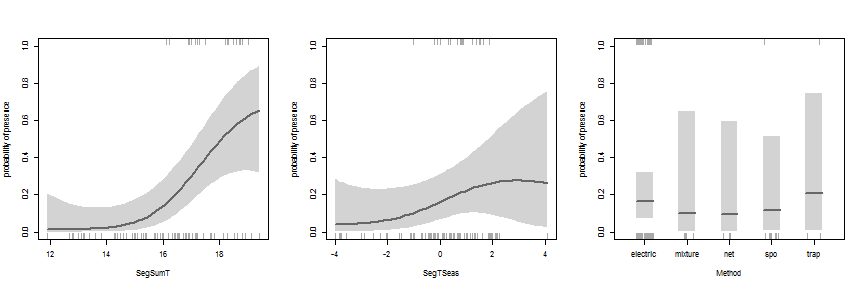
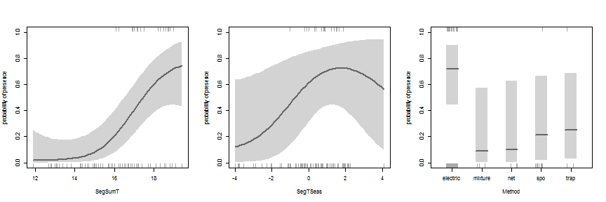

GRaF R workshop - INTECOL 2013
=====

This file contains the code and outputs for a tutorial/walkthrough of the ```GRaF``` R package for species distribution modelling.

The package will be demonstrated using a subset of the *Anguilla australis* dataset available in the ```dismo``` package. For more information on this dataset [click here](http://www.inside-r.org/packages/cran/dismo/docs/Anguilla_train) or type ```?Anguilla_train``` into R after loading ```dismo```.

Data
----

First we load the ```dismo``` R package and the ```Anguilla_train``` dataset.


```r
# if the package isn't already installed on your machine:
# install.packages('dismo')

# load the package
library(dismo)
```

```
## Loading required package: raster
```

```
## Loading required package: sp
```

```r

# load the Anguilla_train dataset
data(Anguilla_train)

# and have a quick look at it
head(Anguilla_train)
```

```
##   Site Angaus SegSumT SegTSeas SegLowFlow DSDist DSMaxSlope USAvgT
## 1    1      0    16.0    -0.10      1.036  50.20       0.57   0.09
## 2    2      1    18.7     1.51      1.003 132.53       1.15   0.20
## 3    3      0    18.3     0.37      1.001 107.44       0.57   0.49
## 4    4      0    16.7    -3.80      1.000 166.82       1.72   0.90
## 5    5      1    17.2     0.33      1.005   3.95       1.15  -1.20
## 6    6      0    15.1     1.83      1.015  11.17       1.72  -0.20
##   USRainDays USSlope USNative DSDam   Method LocSed
## 1      2.470     9.8     0.81     0 electric    4.8
## 2      1.153     8.3     0.34     0 electric    2.0
## 3      0.847     0.4     0.00     0      spo    1.0
## 4      0.210     0.4     0.22     1 electric    4.0
## 5      1.980    21.9     0.96     0 electric    4.7
## 6      3.300    25.7     1.00     0 electric    4.5
```


To simplify the tutorial we'll subset the data, keeping only the first 300 records and three of the covariates. GRaF needs the response vector (1s and 0s denoting presence or absence) and a dataframe of the covariates as separate objects, so we'll do that now too.


```r

# set the number of records to keep
n <- 100

# keep the first n records of SegSumT, SegTSeas and Method as covariates
covs <- Anguilla_train[1:n, c("SegSumT", "SegTSeas", "Method")]

# get presence/absence status for these first n records
pa <- Anguilla_train$Angaus[1:n]
```


Fitting a model
----

We can fit a simple ```GRaF``` model to this data using the ```graf``` function. Note that the second argument has to be a dataframe, not a vector or a matrix.

```r
# install GRaF if needed install.packages('GRaF')

# and load the package
library(GRaF)

# then fit a simple model
m1 <- graf(pa, covs)
```


We can quickly plot the fitted model. There are three covariates, so three plots will be produced. Each plot gives the estimated effect of the covariate whilst holding the other variables at their mean value; i.e. a conditional effect rather than a marginal.


```r
par(mfrow = c(1, 3))
plot(m1)
```

 


The grey areas give the 95% credible intervals (the Bayesian equivalent of confidence intervals) and the data values are given by tick marks on the upper (for presence points) and lower (absence points) margins of the plot. Discrete covariates which are classed as factors in the dataframe are shown as box plots.

We can also choose to hold the other covariate values near the value giving the highest probability of presence. See ```?plot.graf``` for more options.


```r
par(mfrow = c(1, 3))
plot(m1, peak = TRUE)
```

 


##### 3D plots

Because GRaF fits potentially complex non-linear interactions between covariates, it can be useful to visualise these with three-dimensional plots. ```plot3d``` is a wrapper around the ```persp``` function to do this for pairs of continuous covariates. Unfortunately 3D plotting with discrete covariates isn't implemented yet.


```r
# we'll plot the CIs too, so we need three panels
par(mfrow = c(1, 3))

# plot the prediction surface across the first two covariates. Suppress
# plotting of the prior (we'll get to what this means later on) and hold
# the third value near its peak.
plot3d(m1, dims = c(1, 2), prior = FALSE, peak = TRUE)
```

 

```r

# we can rotate the plots using the theta argument to see what's going on
plot3d(m1, dims = c(1, 2), prior = FALSE, peak = TRUE, theta = -30)
```

 


### Changing the lengthscales

GRaF can fit models of varying complexity (variability of the predicted probability along a covariate) and this complexity is controlled by a set of model 'hyperparameters' (parameters which control other parameters) referred to as lengthscales.

There is one lengthscale for each covariate in the model and they must be positive. A large lengthscale gives a model with low complexity (flatter) and a small lengthscale gives a model with high complexity (wigglier).

By default, ```graf``` makes a simple and fairly arbitrary guess at what the best lengthscales might be, but we can specify different lengthscales through the ```l``` argument to ```graf```. The lengthscale used to fit the model can be accessed from the model object.


```r
m1$l
```

```
## [1] 3.932 3.600 0.010
```


Note that for factors (discrete variables) the default is a very short lengthscale of 0.01 - essentially independence between the levels of the factor.

We'll visualise models fitted with different values of ```l```, but only using the first covariate this time.


```r
# fit models with the default setting and with short and long lengthscales
m.short <- graf(pa, covs[, 1, drop = FALSE], l = 0.1)
m.default <- graf(pa, covs[, 1, drop = FALSE])
m.long <- graf(pa, covs[, 1, drop = FALSE], l = 1000)

# set up the plotting device for the three plots
par(mfrow = c(1, 3))

plot(m.short, vars = 1, main = paste("lengthscale", m.short$l))

plot(m.default, vars = 1, main = paste("lengthscale", round(m.default$l, 2)))

plot(m.long, vars = 1, main = paste("lengthscale", m.long$l[1]))
```

 


So the shorter the lengthscale, the more rapidly probability of presence changes with the value of the covariate.

As well as visually assessing the fit of models with different lengthscales, we can make quantitative comparisons between models by calculating the deviance information criterion (DIC) of each model with the ```DIC``` function.


```r
DIC(m.short)
```

```
##    DIC     pD 
## 84.744  6.899
```

```r
DIC(m.default)
```

```
##    DIC     pD 
## 79.619  2.179
```

```r
DIC(m.long)
```

```
##     DIC      pD 
## 100.401   1.024
```


DIC (like other other information criteria, such as AIC) trades off the ability of the model to fit the data against its complexity. With most other information criteria, model complexity is determined by the number of free parameters. In many Bayesian models the number of free parameters isn't well defined, so DIC instead calculates the number of 'effective' parameters. This number of effective parameters is what is given by the ```DIC``` function as ```pD```.

Here, the model ```m.long``` has a ```pD``` of around 1 and so has similar complexity to a binomial regression model with a single regression parameter. ```m.short``` has around 7 effective parameters, so has similar complexity to a seventh-order polynomial linear model. The lower DIC of the default setting suggest this is a better model.

### Optimising the lengthscales

In practice, it's often preferable to automatically select the best lengthscale hyperparameters. ```graf``` does this by numerical optimisation.

Rather than minimising DIC, ```graf``` selects ```l``` using the model marginal likelihood. As with DIC, the marginal likelihood trades off complexity against fit to the data. As a result GRaF is able to fit complex models whilst preventing overfitting to the data in a similar way to regularization methods, like the lasso penalty used in MaxEnt.

GRaF also considers how realistic different lengthscales are for species distribution data, using a prior distribution to determine the realistic range of values that ```l``` could take. The prior distribution is discussed in chapter 4 of [my thesis](http://figshare.com/articles/PhD_thesis_Mapping_and_understanding_the_distributions_of_potential_vector_mosquitoes_in_the_UK_New_methods_and_applications/767289) and the parameters of this prior distribution can be changed via the ```theta.prior.pars``` argument, though we won't discuss this in any more detail here.

We can fit a ```graf``` model with optimized lengthscales by specifying the ```opt.l``` argument. Note that this procedure fits lots of different models, so it takes longer to run. 


```r
# run graf, optimising the lengthscales
m2 <- graf(pa, covs[, 1, drop = FALSE], opt.l = TRUE)

# get the lengthscale
m2$l
```

```
## [1] 3.786
```

```r

# calculate DIC and effective parameters
DIC(m2)
```

```
##   DIC    pD 
## 79.59  2.20
```

```r

# plot the fitted model
plot(m2)
```

 


### Specifying the prior model

As well as the lengthscales, we need to provide GRaF with a prior model, giving our best *a priori* (i.e. before we look at the data) guess at the 'true' underlying model. The prior model acts in the same way as a prior distribution in other Bayesian models and can be used to incorporate existing knowledge about the species' ecology into the SDM.

By default, ```graf``` uses a flat mean function, reflecting a prior belief that the probability of presence is the same everywhere, regardless of the covariates. We can specify just about any prior model we like, by writing it as an R function.

For example, a previous study may have suggested that the probability of presence is low below a threshold of 17 degrees, but high above that temperature:


```r
# define the threshold function
thresh <- function(x) ifelse(x$SegSumT < 17, 0.2, 0.6)

# fit the model, optimising the lengthscale
m3 <- graf(pa, covs[, 1, drop = FALSE], opt.l = TRUE, prior = thresh)
```


or we can use the predict function of another model. Here we estimate the prior by first fitting a glm to the same data. From an orthodox Bayesian perspective this is cheating, but these 'empirical Bayes' approaches can be very effective.


```r
# fit a linear model
m.lin <- glm(pa ~ SegSumT, data = covs, family = binomial)

# wrap the predict method up in a new function
lin <- function(temp) predict(m.lin, temp, type = "response")

# fit the model, optimising the lengthscale
m4 <- graf(pa, covs[, 1, drop = FALSE], opt.l = TRUE, prior = lin)
```


We can show the mean function when plotting by setting ```prior = TRUE```.


```r
par(mfrow = c(1, 3))

plot(m2, prior = TRUE, main = "flat prior")
plot(m3, prior = TRUE, main = "threshold prior")
plot(m4, prior = TRUE, main = "linear prior")
```

 


As with all Bayesian models, where lots of data is available the prior has little effect, but where there is limited data it becomes important. Notice that the middle sections of the curves with the flat and linear mean functions are similar, but at low and high temperatures they're pulled back towards their respective priors.

### Predictions

GRaF has a ```predict``` function similar to other models in R, but doesn't yet have a full interface to the raster package, so a little work is needed to generate prediction maps. We'll demonstrate this using more of the *Anguilla* dataset and predicting to the river network maps available in the dismo package

Because not all of the covariates are available in the raster dataset, we'll subset the Anguilla data again and remove missing values. To make sure ````graf``` handles the discrete variable ```DSDam``` correctly, we'll make it a factor.


```r
# load the prediction rasters from the dismo package
data(Anguilla_grids)

# remove columns not in the raster
ang <- Anguilla_train[, c(2:12, 14)]

# remove records with missing values
ang <- na.omit(ang)

# split the dataset, again using only the first n records to speed things
# up
ang_pa <- ang[1:n, "Angaus"]
ang_covs <- ang[1:n, -1]

# coerce DSDam into a factor
ang_covs$DSDam <- factor(ang_covs$DSDam)
```


Next we fit a model, optimising the lengthscales, and plot the effects of each covariate.


```r
# fit the model
m.ang <- graf(ang_pa, ang_covs, opt.l = TRUE)

# plot the 11 covariates, near the peak of the random field
par(mfrow = c(4, 3))
plot(m.ang, peak = TRUE)

# look at the lengthscales
m.ang$l
```

```
##  [1]  3.551 12.426 10.848 13.168 11.919 12.181 12.722 12.693 13.421  0.010
## [11]  7.747
```

 


Since ```graf``` scales the covariates internally (to have a mean of 0 and standard deviation of 1), the lengthscales for continuous covariates can be used as a rough guide to variable importance. ```SegSumT``` has the lowest lengthscale, suggesting it may be the strongest driver of *Anguilla australis* distribution in this dataset.

##### Prediction maps

To predict from this model to the river network we first need to extract the raster values into a dataframe using ```getValues``` from the ```raster``` package


```r
# remove loc sed since there are lots of NAs
ang_grid_data <- data.frame(getValues(Anguilla_grids))

# make it match-up with the training dataset we turn DSDam into a factor
# again
ang_grid_data$DSDam <- factor(ang_grid_data$DSDam)

# unfortunately graf can't deal with the names being out of order, so
# we'll reorder this
ang_grid_data <- ang_grid_data[, order(order(names(ang_covs)))]

# now we can predict to the new dataset
ang_pred <- predict(m.ang, ang_grid_data)

# and calculate the width of the 95% CIs as a metric of uncertainty
ang_pred <- cbind(ang_pred, uncertainty = ang_pred[, 3] - ang_pred[, 2])
```


GRaF automatically provides credible intervals with these predictions too and by default plots on the probability scale.


```r
# look at the predictions, omitting the missing data values
head(na.omit(ang_pred))
```

```
##      posterior mode lower 95% CI upper 95% CI uncertainty
## [1,]         0.5581       0.2514       0.8320      0.5806
## [2,]         0.5581       0.2514       0.8320      0.5806
## [3,]         0.5151       0.2347       0.7879      0.5533
## [4,]         0.5151       0.2347       0.7879      0.5533
## [5,]         0.5151       0.2347       0.7879      0.5533
## [6,]         0.5151       0.2347       0.7879      0.5533
```


Finally, we put these predictions back into rasters using ```setValues``` and plot them.


```r
# set up a RasterBrick of the correct size and shape
ang_grid_pred <- Anguilla_grids[[1:4]]

# assign the predictions to the RasterBrick
ang_grid_pred <- setValues(ang_grid_pred, ang_pred)

# plot them
plot(ang_grid_pred, zlim = c(0, 1), col = heat.colors(10))
```

 

